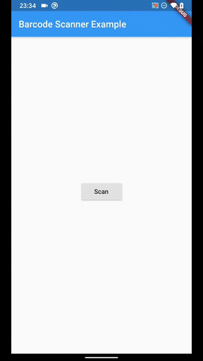

# flutter_barcode_scan

## Screenshots




## Docs

[barcode_scan | Flutter Package](https://pub.dev/packages/barcode_scan)

[Barcode Scanner | GitHub](https://github.com/apptreesoftware/flutter_barcode_reader)

## Example

[apptreesoftware/flutter_barcode_reader/example | GitHub](https://github.com/apptreesoftware/flutter_barcode_reader/tree/master/example)

## Trouble shooting

[Flutter - Android dependency 'androidx.core:core' has different version for the compile (1.0.0) and runtime (1.0.1) classpath | stackoverflow](https://stackoverflow.com/questions/56018413/flutter-android-dependency-androidx-corecore-has-different-version-for-the/56018979)

>You should try with
>
>Change gradle version from 3.2.1 to 3.3.1/ 3.3.2
>DEMO
>
>```yaml
>dependencies {
>            classpath 'com.android.tools.build:gradle:3.3.1'
>        }
>```
>